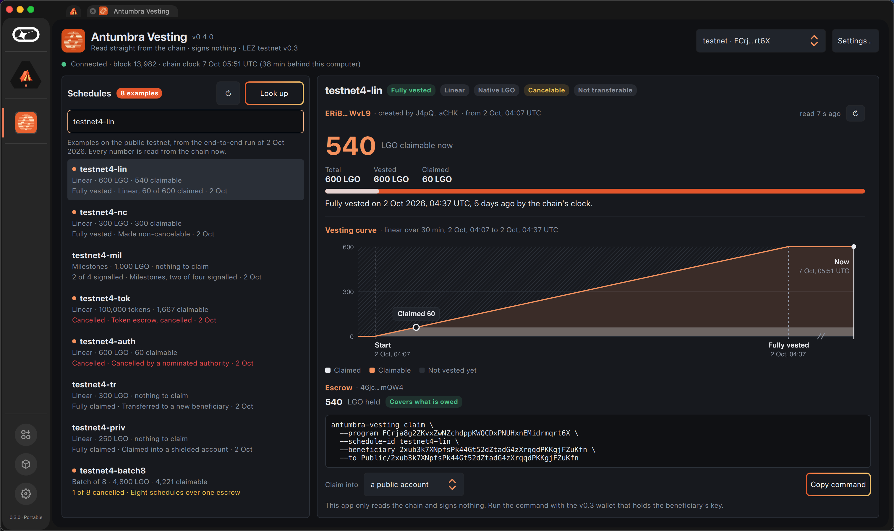
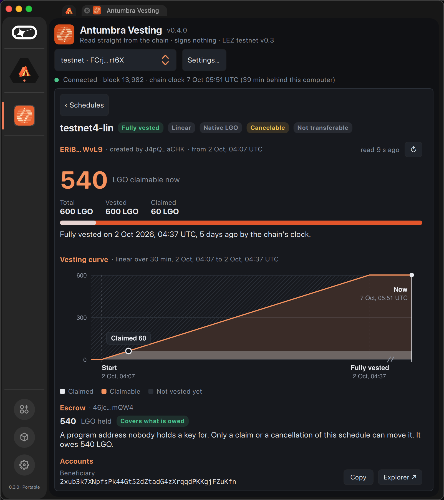
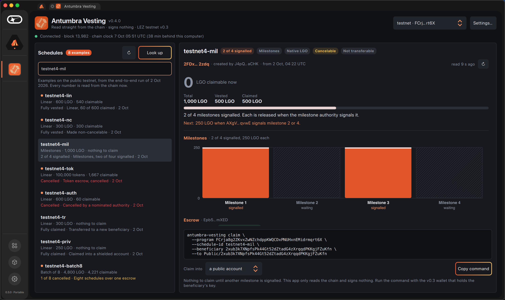
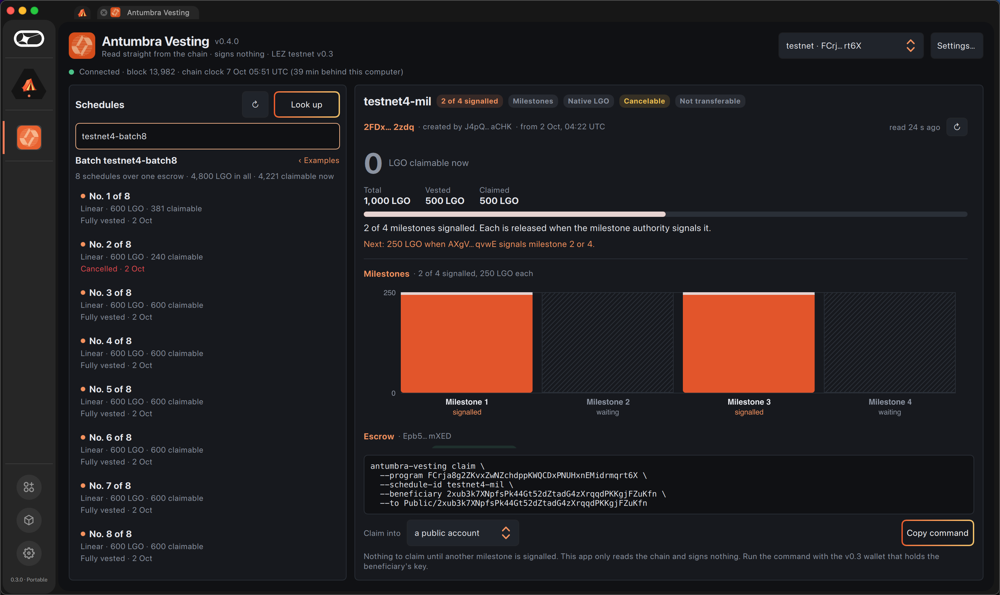
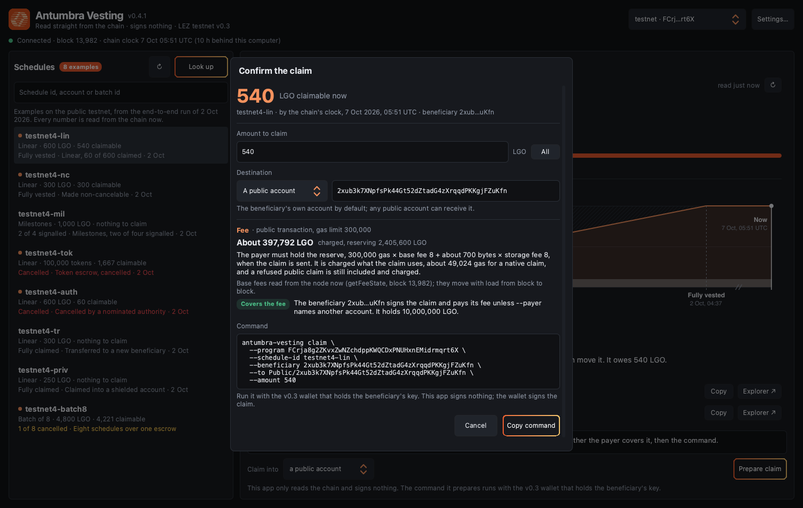
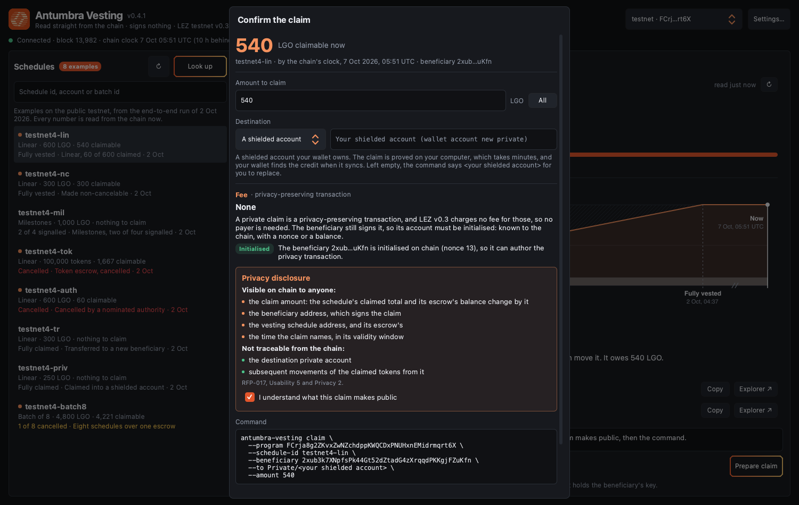

# antumbra-lez

## Antumbra Vesting (RFP-017): live on the LEZ testnet v0.3

Privacy-preserving token vesting for the Logos Execution Zone, deployed and
driven end to end on the public testnet v0.3.

| | |
|---|---|
| Program (header account) | `FCrja8g2ZKvxZwNZchdppKWQCDxPNUHxnEMidrmqrt6X` |
| ImageID | `72d5cdc05004a9502be72239829071982237638b49b8fe7d1b45fd7371a425f4`, read back from the header's loader record |
| On chain | linear and milestone schedules (cliff covered by an executor test; [`scripts/cliff-when-live.sh`](scripts/cliff-when-live.sh) puts one on chain as soon as the testnet, stalled at block 13,982 since 7 October, moves again), cancellation with refund, transferable and non-cancelable positions, nominated authorities, native and token escrow, private claims of native balance and of a token into shielded accounts, a batch of 450 schedules in one transaction (451 refused under the 10M gas cap) |
| Every transaction | [`DEPLOYMENTS.md`](DEPLOYMENTS.md), manifest and transcript in [`evidence/v03/`](evidence/v03/) |
| Re-check it yourself | `./scripts/verify-onchain.sh --manifest evidence/v03/testnet.tsv --rpc https://testnet.lez.logos.co` (66 checks) |
| Reproducible build | CI rebuilds the guest from source in RISC Zero's pinned Docker builder and compares it with the committed binary |
| Source | [`programs/vesting/`](programs/vesting/) (LEZ `v0.3.0`, `db66590a`), port notes in [`docs/v03-port-plan.md`](docs/v03-port-plan.md), requirement tests in [`executor-tests/`](executor-tests/), CLI in [`cli/`](cli/), Basecamp module in [`app/`](app/), runbook in [`docs/deploy-v03.md`](docs/deploy-v03.md) |
| Design decisions | [`docs/DECISIONS.md`](docs/DECISIONS.md): each major decision with its context, options, rationale and trade-offs, v0.2.4 ones kept and marked superseded |

The v0.2.4 deployment and [`evidence/VESTING.md`](evidence/VESTING.md) are
historical: that chain was reset to v0.3 and its hashes no longer resolve.

[](https://github.com/edenbd1/antumbra-lez/actions/workflows/ci.yml?query=branch%3Amain)

### Read a schedule with nothing but cargo

The CLI's read-only commands (`show`, `ids`, `image-id`, `now`) need no
wallet, no keys and no LGO: they ask the sequencer at `--rpc` (by default the
public testnet, or `ANTUMBRA_RPC`) or compute locally, and `--program`
defaults to the deployed header. Only the commands that sign open a wallet.

```bash
git clone https://github.com/edenbd1/antumbra-lez && cd antumbra-lez
cargo build --release --manifest-path cli/Cargo.toml   # Rust 1.98.1, as LEZ v0.3.0
cli/target/release/antumbra-vesting show testnet4-lin
cli/target/release/antumbra-vesting show --batch-id testnet4-batch8
```

`show testnet4-lin` prints the decoded schedule against the chain's clock, among
its fields `"total":"600"`, `"claimed":"60"`, `"vested":"600"` and
`"claimable":"540"`. `show --batch-id testnet4-batch8` derives each member's id
as `sha256(batch ‖ i)`, prints one line per schedule until one is missing, then
the batch's totals:

```text
{"beneficiary":"2xub3k7X…","cancelled_at":0,"claimable":"381","claimed":"219","index":0,…,"total":"600","vested":"600"}
{"beneficiary":"Ffhdk2bb…","cancelled_at":1790916551492,"claimable":"240","claimed":"0","index":1,…,"total":"600","vested":"240"}
… six more, 600 claimable each …
{"batch_id":"746573746e6574342d626174636838…","claimable":"4221","claimed":"219","clock":1791352286660,"holding":"2PGcDdbvicrt4gewMf6BofQBbkEM3XZoRvx6Ve4aDsDW","schedules":8,"total":"4800"}
```

`scripts/cli-readonly.sh` runs these from an empty `HOME` and checks those
numbers; CI runs it against a recording of the testnet's answers
([`cli/tests/fixtures/`](cli/tests/fixtures/)) and the daily chain-refs
workflow against the live testnet. Design note: [D-36](docs/DECISIONS.md).

## Antumbra Vesting in Basecamp


A Basecamp 0.3.0 app ([`app/`](app/), version 0.4.1) to look up a schedule on
the public testnet by its id, its batch or an account, and see what the chain
holds: what is claimable now against the chain's clock, the vesting curve, the
escrow's real balance, the accounts, and every transaction on the schedule
with the program's verdict. It signs nothing. "Prepare claim" opens a
confirmation (RFP-017 U4): the claimable amount, the amount to claim, checked
against it, the destination, and on the public path the fee read from the
node's fee market and whether the beneficiary's balance covers it. On the
private path it checks that the signing account is initialised and shows the
privacy disclosure (U5, Privacy 2), which must be acknowledged before the
exact `antumbra-vesting` command for the beneficiary's wallet appears. It is
built and laid out like Logos Forum: the schedules as its topics, a schedule
as its thread, the claim where its reply box is.



| Basecamp's narrowest window | Milestones | A batch |
|---|---|---|
|  |  |  |

The Basecamp screenshots above are 0.4.0, whose reply box showed the command
directly. The 0.4.1 confirmation, rendered by the test host
([`app/tests/qml_host.cpp`](app/tests/qml_host.cpp)) against the testnet:

| Public path: amount and fee | Private path: the disclosure before the command |
|---|---|
|  |  |

M3 status: the confirmation and disclosure screens (U4, U5, Privacy 2) are in
the app since 0.4.1 and checked by the headless view test on both paths at
three widths, a command never shown on the private path before the disclosure
is acknowledged. The app still signs nothing, so the claim action itself, the
creator view and listing from index PDAs remain M3 work.

Searching by account finds the schedules that account has signed for plus the
examples: the chain cannot list schedules by beneficiary, and the app says so.
More in [`app/README.md`](app/README.md) and
[D-35](docs/DECISIONS.md).

## The pricing library

The repository also holds `antumbra`, the integer arithmetic the programs share:
the vesting schedules, and the constant-product bonding curve and weighted pool
written for [RFP-015](https://github.com/logos-co/rfp/blob/master/RFPs/RFP-015-bonding-curve-launchpad.md)
and RFP-016. The rest of this README is about that library.

Integer-only constant-product bonding curve math for the Logos Execution Zone,
written for [Logos RFP-015](https://github.com/logos-co/rfp/blob/master/RFPs/RFP-015-bonding-curve-launchpad.md).

```
cargo test --release
```

51 tests green. The pricing library has no dependencies at all (the
executor harness is a separate workspace), and `#![forbid(unsafe_code)]`
throughout.

## What this found

RFP-015's reference implementation says the invariant is **`k = Vt × Vc`,
computed and stored at creation**. For any realistic 18-decimal token pair that
number does not exist in a `u128`:

```
Vt = 1e9 tokens x 1e18 = 1e27
Vc = 1e6 tokens x 1e18 = 1e24
k  = 1e51                        u128::MAX = 3.4e38
```

So `k` cannot be stored as written, and every pricing call that divides by it
needs a 256-bit intermediate. `k_does_not_fit_in_u128_for_an_eighteen_decimal_pair`
asserts the overflow and then prices the pair anyway.

The fix is not a bigger field. **`k` is never materialised.** Each formula folds
into one `mul_div` whose product is taken in 256 bits and whose quotient is
proven to fit in 128:

```
buy      tokens_out = Vt - k/(Vc + C_in)  = Vt - mul_div(Vt, Vc, Vc + C_in)
inverse  C_in       = k/(Vt - Q) - Vc     = mul_div(Vt, Vc, Vt - Q) - Vc
sell     C_out      = Vc - k/(Vt + t_in)  = Vc - mul_div(Vc, Vt, Vt + t_in)
```

The identity is exact, so folding changes nothing about the invariant and
removes the overflow.

## Rounding is solvency

Every rounding decision favours the pool:

| operation | quantity | direction | who keeps the dust |
|---|---|---|---|
| buy | `tokens_out` | down | the pool |
| inverse | `C_in` | up | the buyer pays it |
| sell | `C_out` | down | the pool |

A quotient that rounds the other way is not a rounding bug, it is a withdrawal:
it lets a trader extract value the invariant never created.
`a_buy_then_an_immediate_sell_never_profits` is the property that closes the
dust-loop drain.

## The reference is a different language

`tests/vectors/mul_div.txt` is generated by `tests/gen_vectors.py` from Python's
arbitrary-precision integers. A differential test whose reference shares the
implementation's assumptions proves only that the implementation agrees with
itself.

4,000 vectors, deliberately biased towards the hard cases: huge products, small
divisors, and divisors sitting right at the 128-bit boundary. **Half of them are
cases where the exact quotient does not fit in 128 bits**, and the implementation
must refuse those by name rather than return a truncated number.

## What the differential test caught

The first version of `wide_div` did this:

```rust
rem = (rem << 1) | bit;
if rem >= d { rem -= d; quo |= 1; }
```

`rem << 1` overflows whenever `rem` carries its top bit, which happens for any
large divisor, and Rust drops the bit **silently** in release builds. It
mispriced roughly half the vectors. The fix reads the top bit before the shift;
the comment in `src/lib.rs` records it, because the bug is more instructive than
the fix.

This is also why `Cargo.toml` sets `overflow-checks = true` on the release
profile: a missed `checked_*` should panic in a test rather than corrupt a
reserve in production.

## Where the guardrails are

- **Dust.** A one-unit buy is priced at the spot rate, not rounded to nothing,
  and never mints tokens out of rounding.
- **Near exhaustion.** The whole sale reserve must be quotable; a request beyond
  it is refused by name before any arithmetic runs.
- **Creation.** `Vt > D` is enforced rather than trusted: a curve created below
  it prices its last token at infinity.
- **Slippage.** Refused before any state moves, asserted by comparing the whole
  struct before and after.
- **Two buckets.** The sale reserve and the real collateral are accounted
  separately, and `the_reserve_accounting_never_drifts` asserts token
  conservation and that the pool never pays out more than it took in, over
  24,000 randomised interleavings of buys and sells.

## The weighted pool: a fractional power in integer arithmetic

`src/weighted.rs` is the other half, for
[RFP-016](https://github.com/logos-co/rfp/blob/master/RFPs/RFP-016-lbp-launchpad.md),
whose swap formula carries a **rational exponent**:

```
tokens_out = Rt * (1 - (Rc / (Rc + C_in)) ^ (w_c / w_t))
```

`x^e = exp(e * ln x)` at a scale of 1e18, with argument reduction on both
series. Two things in it are worth more than the code:

**The reduction direction decides the precision.** Reducing into `[1, 2)` gives
`-ln x = k*ln2 - ln m`, a subtraction of two numbers both near 0.693 whenever x
is near 1. At x = 0.99974 the difference is 0.00025, three significant digits
destroyed by cancellation, then multiplied by an exponent of up to 99. The first
version did that and measured a worst error of **7e-12**. Reducing into
`[1/2, 1)` instead makes it `k*ln2 + (-ln m)`, both terms non-negative. An
addition cannot cancel.

**The series length is a cycle budget, so it is a named constant.** `z = 1/3`
exactly at x = 1/2, the worst case, reached by every halving. Twelve terms
leaves a 1e-13 tail; twenty-four puts it below 1e-19, at twelve more 256-bit
multiplications per call.

Measured against 2,500 vectors from Python's `decimal` at 60 significant digits,
biased towards x within 1e-3 of one, x down at 1e-18, and weight ratios from
99/1 to 1/99:

| | worst absolute error, scale 1e18 |
|---|---|
| first version, decimal scale | 6,976,874 &nbsp;(7e-12) |
| after both fixes | 86 &nbsp;(8.6e-17) |
| `binfixed`, binary scale | **13** &nbsp;(1.3e-17) |

**The residual error points the safe way.** `pow` sits slightly above exact in
about half the vectors; `tokens_out = Rt * (1 - pow)` then rounds a high `pow`
into a *low* payout. The pool keeps the difference, which is the same rule the
bonding curve follows.

Also asserted: `pow` is monotone in the exponent, so no weight in the schedule
pays better than the weights either side of it; a bigger buy never gets a better
rate; and `weight_at` returns the correct weight **with no poke at all**, checked
at every tick of a thousand-second schedule, which is the RFP's own wording,
"regardless of how recently the last poke occurred".

## Vesting

`src/vesting.rs` covers [RFP-017](https://github.com/logos-co/rfp/blob/master/RFPs/RFP-017-token-vesting.md):
three schedule shapes, the cancellation split, and milestone signalling. None of
it needs an account model to be settled, so none of it waits for one.

Two properties are worth more than the code. **Claims over a fully elapsed
schedule sum to the total exactly**: rounding each step down would normally
strand dust, so the final step returns the total directly rather than dividing
again; the two agree mathematically, but routing the end through the general
branch would make exactness depend on a division being exact, which it is not.
And **the cancellation split is three-way**: already-claimed,
vested-but-unclaimed and unvested all come from one `vested_at` call so they
cannot drift, with the test sweeping every cancellation instant, with and
without a prior claim, asserting the three sum to the original total.

Nothing is cached. `vested_at` is a pure function of the schedule and a
timestamp, the same choice `weight_at` makes, for the same reason: there is no
stale value, so there is no stale-value bug.

## What CI actually checks

Not just that the tests pass.

- `cargo fmt --check` and `cargo clippy -D warnings`.
- The suite in **release**, because the release profile sets
  `overflow-checks = true`; running it in debug would exercise different
  arithmetic from the one that ships.
- **The committed vectors are regenerated and diffed against their generators.**
  A vector file quietly edited to make a failing test pass would not survive
  this, and that is the failure mode a committed oracle actually has.
- **The cycle table is re-measured and compared to `zkvm/CYCLES.md`.** The
  document is quoted in grant proposals; a figure that drifts is a public claim
  that stopped being true, and nobody notices until someone reproduces it. So
  `zkvm/verify_cycles.py` fails the build instead.

## Fees

`src/fees.rs` implements both collection models, because the two RFPs differ for
a reason that decides the code. A bonding curve is demand-bounded (under 1.4%
ever graduate), so its fee is per swap or it earns nothing. An LBP is
time-bounded, so every sale reaches its end and an at-close fee is always
collectible.

Every fee rounds **up**, against the party paying: the trader on a swap, the
creator at close. And the ordering on a buy is asserted rather than commented:
the fee comes off *before* pricing, so the curve prices `c_in - fee`. Taking it
after would credit the curve with collateral the treasury removes, inflating the
reserve by the fee on every trade; the test constructs both and asserts the
correct one ends with less.

Both proposals ship at a zero rate with a governance switch, so the cap is
compiled in: 1% per swap, 5% at close. A rate above it is **refused by name, not
clamped**: silently clamping a misconfiguration hides it from the person who
needs to see it.

## Deployed

**LEZ v0.3.** `antumbra_vesting` has been ported to v0.3 and driven end to end on
a local v0.3.0 sequencer, then deployed on the public testnet v0.3 and driven
there in full ([`DEPLOYMENTS.md`](DEPLOYMENTS.md), [`evidence/v03/`](evidence/v03/)).
`./scripts/verify-onchain.sh --manifest evidence/v03/testnet.tsv --rpc https://testnet.lez.logos.co`
re-checks the run from its manifest.

**Historical, LEZ v0.2.4.** The table below is the record of the v0.2.4
deployments. That testnet has since been upgraded to v0.3, so these hashes no
longer resolve; `scripts/verify-onchain-v024.sh` is the checker they were
verified with.

Three programs were live on the public LEZ testnet, and each deployment carries
the same four facts: the commit it was frozen at, the ImageID, the deploy
transaction and the block. That is the convention `logos-co/lez-payment-streams`
sets for its own live program, and it is what makes a deployment checkable
rather than asserted.

| Program | Freeze commit | ImageID | Deploy | Block |
|---|---|---|---|---|
| `antumbra_curve` | [`b5aa3da`](https://github.com/edenbd1/antumbra-lez/commit/b5aa3da) | `49db0fc9…a56fc510` | [`f074ffe1…4d8c3855`](https://explorer.testnet.lez.logos.co/transaction/f074ffe110131ed108d7ea37d6445d7492ff36842ed63399b005dc364d8c3855) | 17265 |
| `antumbra_lbp` | [`b5aa3da`](https://github.com/edenbd1/antumbra-lez/commit/b5aa3da) | `51f28557…b6c7a82d` | [`fbfe7e39…7bbe4859`](https://explorer.testnet.lez.logos.co/transaction/fbfe7e3960cd787a26699cd2690d6a663f88c895f4a68ee6bf7dffa47bbe4859) | 17266 |
| `antumbra_vesting` | [`ca8dc1b`](https://github.com/edenbd1/antumbra-lez/commit/ca8dc1b365986f7e62c281dce0c89df2aee8f449) | `7763458b…591a2bb6` | [`2b9e140b…b39d3813`](https://explorer.testnet.lez.logos.co/transaction/2b9e140b873e424cbed956b3652154eca9e997beb5711c2894471cacb39d3813) | 27115 |

**The vesting program reads the chain's clock, escrows native balance or a
token-program token, and pays claims into public or shielded accounts.** Every
call made against the deployed program is on one page,
[`evidence/VESTING.md`](evidence/VESTING.md), generated from the replay log;
`./scripts/verify-onchain.sh --only vesting` re-checks it against the sequencer,
and [`executor-tests/`](executor-tests/) runs the same binary through the
sequencer's execution path, one test per requirement, with the per-instruction
cost table. **The public testnet was reset on 2026-09-08**; the curve and pool
rows above predate it and have not been re-driven.

An earlier set of the same three programs was on chain before the reset and is what the RFP-015
and RFP-016 issues quote, because those are the ones that were *driven* rather than merely
deployed: they are built by
[`8c09b33`](https://github.com/edenbd1/antumbra-lez/commit/8c09b33), and their
ImageIDs are `bcd6d07d…`, `249648dc…` and `26134c79…`. Check an ImageID against
the freeze commit rather than against `main`, or the numbers will disagree for a
reason that is not a defect. [`DEPLOYMENTS.md`](DEPLOYMENTS.md) has both tables,
the reconciliation, and every transaction that drove them.

## Status

`antumbra_vesting` is the program of the RFP-017 proposal and runs on the
public testnet v0.3 (see the top of this page). The bonding curve and weighted
pool programs were built and driven on v0.2.4 and have not been ported to v0.3;
their arithmetic lives on in the `antumbra` library above.

## Licence

MIT OR Apache-2.0, at your option:
[`LICENSE-MIT`](LICENSE-MIT) and [`LICENSE-APACHE`](LICENSE-APACHE).

## Cycle cost

`zkvm/` runs the whole kernel under the RISC0 3.0.5 executor and reports
`cycle_count()` deltas per operation; results and their reading are in
[`zkvm/CYCLES.md`](zkvm/CYCLES.md). A constant-product buy is **10,622
cycles**, flat across trade sizes, against LEZ's 32M public-execution cap.
A vesting claim is **8,808** and a milestone signal is **30**. The fractional
power went from **314,248** cycles to **27,181** by moving to a binary working
scale, 11.6x faster and 6.6x more accurate at the same time, with the
first attempt at that rewrite recorded alongside it because it was wrong in a
way worth keeping.
