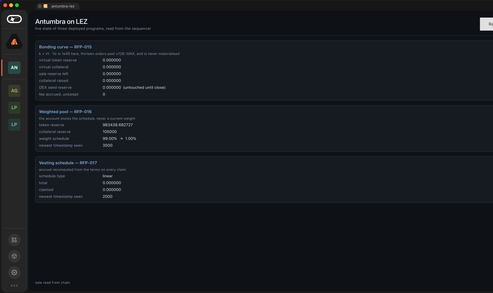

# Basecamp module

A read-only panel showing the live state of the three deployed Antumbra
programs, fetched from a LEZ sequencer over JSON-RPC and decoded from the borsh
account data. It holds no keys and signs nothing — giving an analytics surface
signing power would make it a custody risk for no gain.

It shows two things a cached copy would misrepresent most: the **native balance
each holding PDA actually escrows**, read straight from the account rather than
inferred from the program's own bookkeeping, and the **fee accrued but not yet
swept**. When those two disagree with the decoded state, the decoded state is
wrong, and a panel that only rendered one of them would never say so.

`antumbra-lez.lgx` is the package. It carries one variant, `darwin-arm64`.

## It loads, and here is the control that makes that mean something

Building a plugin is not loading it, and loading it is not implementing the
host's interface. All three were checked against **Basecamp 0.2.2's own bundled
Qt**, not against ours:

```
  Qt in this process : 6.9.2
  declared IID       : com.logos.component.IComponent
  load()             : ok
  instance()         : AntumbraPlugin
  qobject_cast       : IComponent obtained
```

And the same source, built against Homebrew's Qt instead:

```
  load()             : FAILED - The plugin uses incompatible Qt library. (6.11.0) [release]
```

That second run is the point. **Qt's version check is a ceiling, not a floor**:
it refuses any plugin whose minor version exceeds the host's. Basecamp 0.2.2
bundles Qt 6.9.2, so a plugin built against the current Homebrew Qt is rejected
outright — and rejected *silently* from the user's side, because Basecamp's file
log truncates before the loader messages. A tile appears, clicking it produces
nothing, and there is no visible error.

The dylib **extracted from the packaged `.lgx`** was load-tested too, not just
the one in `build/`. A package that ships a different binary from the one you
verified has verified nothing.

## And loading is not running, which cost us the host process

`QPluginLoader::load()` returning true says the binary is ABI-compatible and
exports the interface. It says nothing about what happens when the panel is
actually used. Clicking the tile in Basecamp 0.2.2 killed the host outright —
`SIGTRAP`, no dialog, no log line, the window simply gone:

```
libsystem_pthread.dylib   pthread_jit_write_protect_np
libpcre2-16.0.dylib       sljit_malloc_exec
libpcre2-16.0.dylib       pcre2_jit_compile_16
QtCore                    QRegularExpressionPrivate::compilePattern()
QtNetwork                 macQueryInternal(QNetworkProxyQuery const&)
QtNetwork                 QNetworkProxyFactory::systemProxyForQuery(...)
QtNetwork                 QNetworkReplyHttpImplPrivate::postRequest(...)
```

Read bottom-up: the first HTTP request triggers Qt's macOS system-proxy lookup,
which builds a `QRegularExpression`, which asks PCRE2 to JIT-compile it. Basecamp
runs under the hardened runtime *without* `com.apple.security.cs.allow-jit`, so
the JIT allocation traps and takes the process down. Any module that makes a
network call through `QNetworkAccessManager` hits this — ours does on every
refresh, which is the whole point of it.

A module cannot add an entitlement to somebody else's signed binary, so it
declines the lookup instead. Two lines in the `ChainBridge` constructor:

```cpp
QNetworkProxyFactory::setUseSystemConfiguration(false);
m_net.setProxy(QNetworkProxy::NoProxy);
```

Direct connection only, which is what talking to a sequencer over its public URL
wanted anyway. After the fix the panel opens and reads chain state:



Two of the three panels read zero. That is not a decoding failure — those PDAs
belong to the frozen deployments in `DEPLOYMENTS.md`, which were initialised but
never driven; the driven state lives on the earlier deployments. The weighted
pool is the one this build points at that was driven, and it shows the schedule
running from 99% to 1%.

**The lesson generalises past this module.** A load test is a necessary control
and we will keep running it, but the claim it supports is "the host will accept
this binary", not "the host survives using it". Those need separate evidence.

## Build it

Basecamp bundles Qt 6.9.2, so build against 6.9.2. Get it without disturbing the
system Qt:

```bash
python3 -m venv /tmp/aqt && /tmp/aqt/bin/pip install aqtinstall
/tmp/aqt/bin/aqt install-qt mac desktop 6.9.2 clang_64 --outputdir /tmp/Qt

cd app
cmake -S . -B build -DCMAKE_PREFIX_PATH=/tmp/Qt/6.9.2/macos -DCMAKE_BUILD_TYPE=Release
cmake --build build -j4
```

Official builds also reference frameworks as `@rpath/…`, which resolves against
Basecamp's bundled Qt; Homebrew builds hardcode `/opt/homebrew/opt/qtbase/lib/…`
and fail anywhere but this machine.

Then package:

```bash
python3 scripts/package-lgx.py --out app/antumbra-lez.lgx
python3 scripts/package-lgx.py --verify app/antumbra-lez.lgx
```

## Three things that are not obvious and cost a build each

1. **`QtConcurrent` is not bundled by Basecamp.** Linking it makes the plugin
   unloadable. The bridge is asynchronous through `QNetworkAccessManager`
   instead, which also avoids freezing the host with a nested event loop inside
   `createWidget`.
2. **The IID must be `com.logos.component.IComponent`.** That exact string is
   what `qobject_cast` compares across the plugin boundary; a private one gives
   *"Plugin does not implement IComponent"*.
3. **The `IComponent` vtable is exactly three entries** — the destructor,
   `createWidget`, `destroyWidget`. An extra virtual shifts every later slot, so
   the host calls the wrong function through a pointer that cast fine. `name()`
   is deliberately a non-virtual accessor.

And a fourth from the manifest: `lgx add` leaves `type` empty because it never
reads `metadata.json`, and **a module with an empty `type` is invisible** in
Basecamp. `package-lgx.py` folds it back in, which is why the manifest here
reads `type: ui`.
