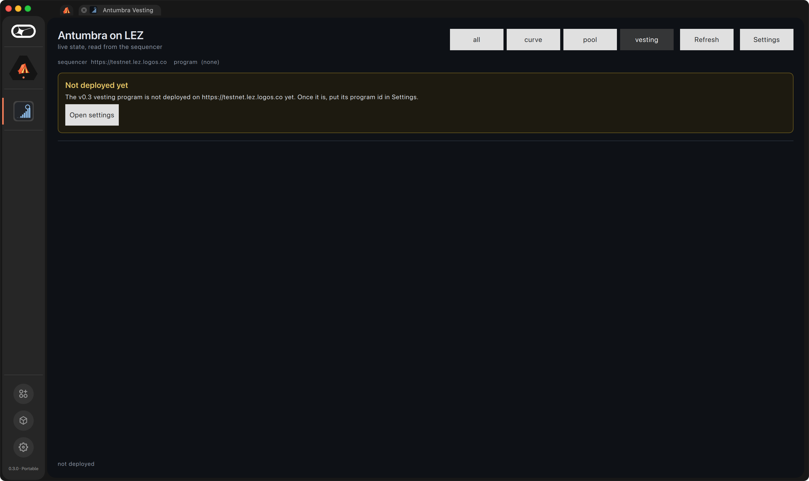
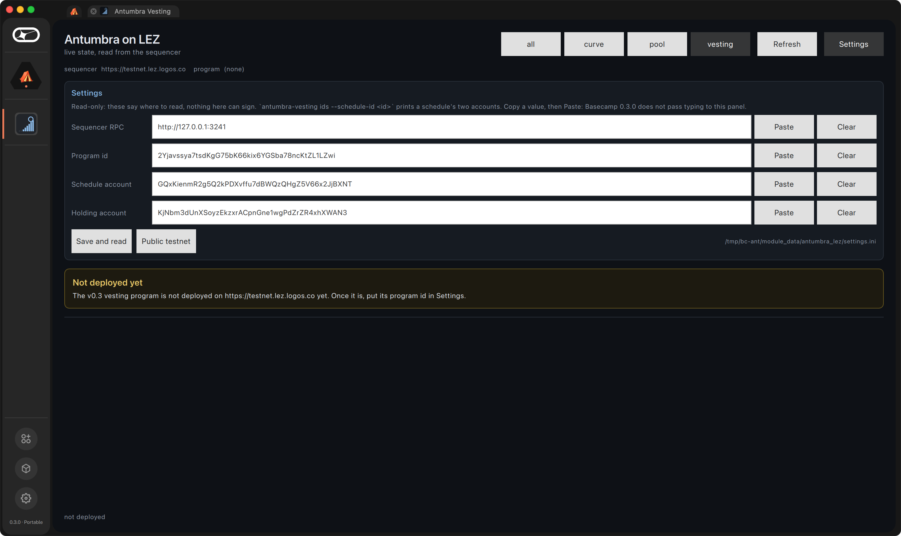
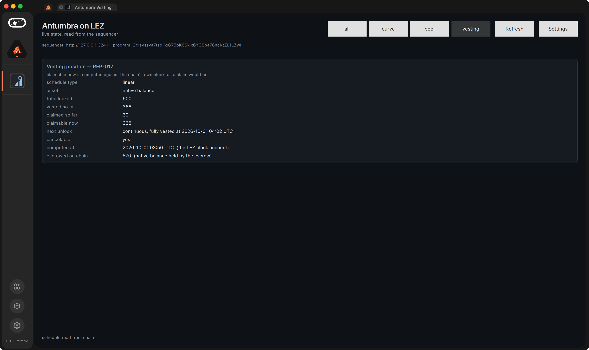
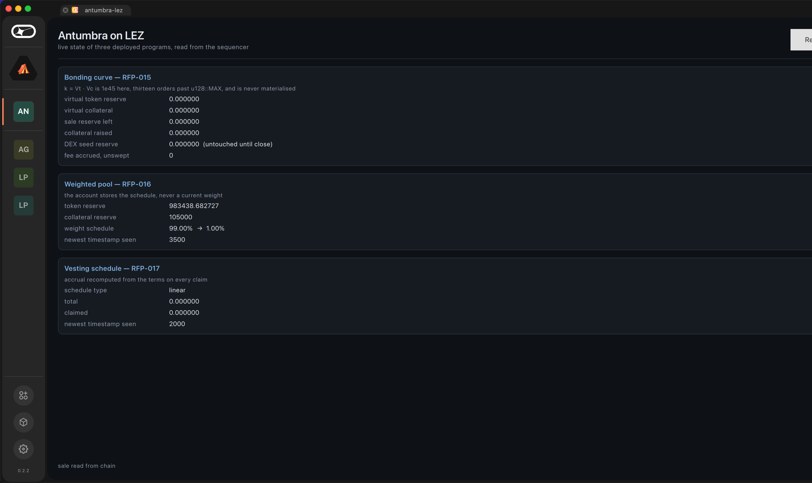

# Basecamp module

A read-only panel showing the live state of the three deployed Antumbra
programs, fetched from a LEZ sequencer over JSON-RPC and decoded from the borsh
account data. It holds no keys and signs nothing — giving an analytics surface
signing power would make it a custody risk for no gain.

It shows two things a cached copy would misrepresent most: the **native balance
each holding PDA actually escrows**, read straight from the account rather than
inferred from the program's own bookkeeping, and the **fee accrued but not yet
swept**. When those two disagree with the decoded state, the decoded state is
wrong, and a panel that only rendered one of them would never say so.

`antumbra-lez.lgx` is the package, built with logos-module-builder
(`mkLogosModule`, see [`flake.nix`](flake.nix)) for Basecamp 0.3.0. The committed
file carries the `darwin-arm64` variant; CI builds `linux-amd64` too and merges
both into one package (the `module` and `module-package` jobs).

## In Basecamp 0.3.0, against a local v0.3 sequencer

Until the v0.3 vesting program is deployed on the public testnet the panel
says so, and reads nothing:



Where it reads is a setting, not a constant: the sequencer RPC (default
`https://testnet.lez.logos.co`), the program id (empty until deployed), and the
schedule and holding accounts to follow (`antumbra-vesting ids --schedule-id
<id>` prints both). They are saved to
`$LOGOS_USER_DIR/module_data/antumbra_lez/settings.ini`, so a throwaway
`--user-dir` never touches another instance's settings. `ANTUMBRA_RPC`,
`ANTUMBRA_PROGRAM`, `ANTUMBRA_SCHEDULE` and `ANTUMBRA_HOLDING` override them.



Pointed at a local LEZ v0.3.0 sequencer (`sequencer_service` from tag
`v0.3.0`, commit `db66590ab`, standalone) after `scripts/e2e-v03.sh` deployed
the program and created a linear native schedule, the panel decodes the
schedule's shard and the escrow's balance, and computes claimable against the
chain's clock account. The numbers are the CLI's (`antumbra-vesting show`) for
the same schedule at the same moment: 600 locked, 30 claimed, 570 escrowed.



**Typing does not reach the panel in Basecamp 0.3.0.** Clicks do, keys do
not: Basecamp keeps keyboard activation on its own window, and a legacy `ui`
widget module never receives the key events (measured with a focus and key
event log inside the plugin; Basecamp's own search field types fine). So
every settings field has a Paste button that reads the clipboard: copy a
value, click Paste.

To reproduce on a throwaway Basecamp instance, never your own:

```bash
nix build ./app#lgx-portable --accept-flake-config -o result
scripts/install-local.sh /tmp/bc-antumbra result/*.lgx
~/Applications/LogosBasecamp-0.3.0.app/Contents/MacOS/LogosBasecamp --user-dir /tmp/bc-antumbra
```

## It loads, and here is the control that makes that mean something

Building a plugin is not loading it, and loading it is not implementing the
host's interface. All three were checked against **Basecamp 0.2.2's own bundled
Qt**, not against ours:

```
  Qt in this process : 6.9.2
  declared IID       : com.logos.component.IComponent
  load()             : ok
  instance()         : AntumbraPlugin
  qobject_cast       : IComponent obtained
```

And the same source, built against Homebrew's Qt instead:

```
  load()             : FAILED - The plugin uses incompatible Qt library. (6.11.0) [release]
```

That second run is the point. **Qt's version check is a ceiling, not a floor**:
it refuses any plugin whose minor version exceeds the host's. Basecamp 0.2.2
bundles Qt 6.9.2, so a plugin built against the current Homebrew Qt is rejected
outright — and rejected *silently* from the user's side, because Basecamp's file
log truncates before the loader messages. A tile appears, clicking it produces
nothing, and there is no visible error.

The dylib **extracted from the packaged `.lgx`** is the one tested, not one
left in a build directory: a package that ships a different binary from the one
you verified has verified nothing. CI does this on every push: the `module`
job builds the package with `nix build ./app#lgx-portable`, unpacks it on
macOS, installs Qt 6.9.2, the version Basecamp bundles, and runs [`app/tests/ui_plugin_load_test.cpp`](tests/ui_plugin_load_test.cpp):
the binary binds every symbol, QPluginLoader accepts it and refuses a file that
is not a plugin, the IID and metadata are what Basecamp compares against, and a
widget comes back through the vtable and is taken back.

## And loading is not running, which cost us the host process

`QPluginLoader::load()` returning true says the binary is ABI-compatible and
exports the interface. It says nothing about what happens when the panel is
actually used. Clicking the tile in Basecamp 0.2.2 killed the host outright —
`SIGTRAP`, no dialog, no log line, the window simply gone:

```
libsystem_pthread.dylib   pthread_jit_write_protect_np
libpcre2-16.0.dylib       sljit_malloc_exec
libpcre2-16.0.dylib       pcre2_jit_compile_16
QtCore                    QRegularExpressionPrivate::compilePattern()
QtNetwork                 macQueryInternal(QNetworkProxyQuery const&)
QtNetwork                 QNetworkProxyFactory::systemProxyForQuery(...)
QtNetwork                 QNetworkReplyHttpImplPrivate::postRequest(...)
```

Read bottom-up: the first HTTP request triggers Qt's macOS system-proxy lookup,
which builds a `QRegularExpression`, which asks PCRE2 to JIT-compile it. Basecamp
runs under the hardened runtime *without* `com.apple.security.cs.allow-jit`, so
the JIT allocation traps and takes the process down. Any module that makes a
network call through `QNetworkAccessManager` hits this — ours does on every
refresh, which is the whole point of it.

A module cannot add an entitlement to somebody else's signed binary, so it
declines the lookup instead. Two lines in the `ChainBridge` constructor:

```cpp
QNetworkProxyFactory::setUseSystemConfiguration(false);
m_net.setProxy(QNetworkProxy::NoProxy);
```

Direct connection only, which is what talking to a sequencer over its public URL
wanted anyway. After the fix the panel opens and reads chain state:



Two of the three panels read zero. That is not a decoding failure — those PDAs
belong to the frozen deployments in `DEPLOYMENTS.md`, which were initialised but
never driven; the driven state lives on the earlier deployments. The weighted
pool is the one this build points at that was driven, and it shows the schedule
running from 99% to 1%.

**The lesson generalises past this module.** A load test is a necessary control
and we will keep running it, but the claim it supports is "the host will accept
this binary", not "the host survives using it". Those need separate evidence.

## Build it

```bash
export PATH=/nix/var/nix/profiles/default/bin:$PATH
nix build ./app#lgx-portable --accept-flake-config -o result   # from the repo root
```

The builder pins Qt 6.9.2, the version Basecamp 0.3.0 bundles, and the dylib
references Qt as `@rpath/…`, which resolves against Basecamp's own frameworks.
The QML is compiled in with zlib rather than zstd, since a zstd resource needs
a QtCore built with zstd and not every Qt 6.9.2 is.

The plain CMake path (no `LOGOS_MODULE_BUILDER_ROOT`) still builds the same
sources against any Qt 6.9.2 for QML iteration; it is not how the package is
made.

## Three things that are not obvious and cost a build each

1. **`QtConcurrent` is not bundled by Basecamp.** Linking it makes the plugin
   unloadable. The bridge is asynchronous through `QNetworkAccessManager`
   instead, which also avoids freezing the host with a nested event loop inside
   `createWidget`.
2. **The IID must be `com.logos.component.IComponent`.** That exact string is
   what `qobject_cast` compares across the plugin boundary; a private one gives
   *"Plugin does not implement IComponent"*.
3. **The `IComponent` vtable is exactly three entries** — the destructor,
   `createWidget`, `destroyWidget`. An extra virtual shifts every later slot, so
   the host calls the wrong function through a pointer that cast fine. `name()`
   is deliberately a non-virtual accessor.

And a fourth from the manifest: a module with an empty `type` is invisible in
Basecamp. The builder's bundler writes `type: ui` from `metadata.json` into the
package manifest, and CI asserts it.
