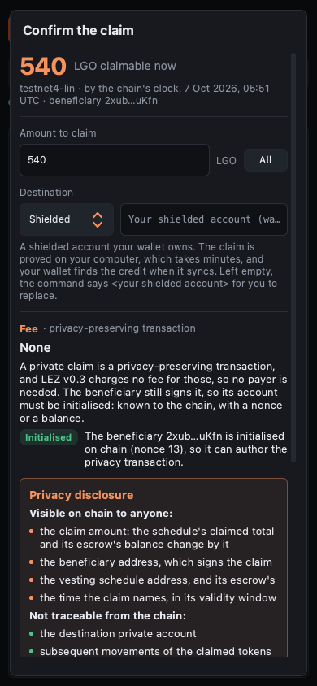
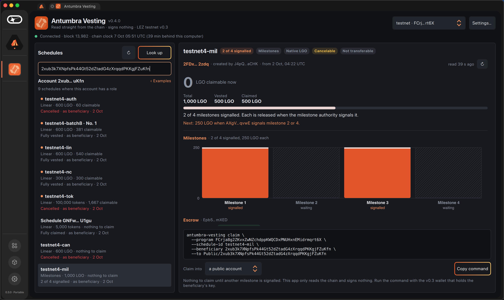
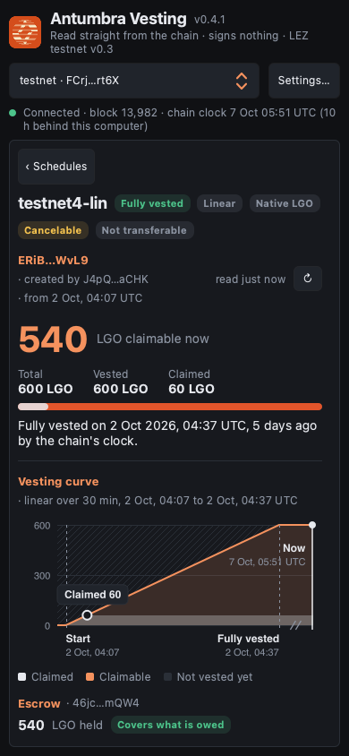
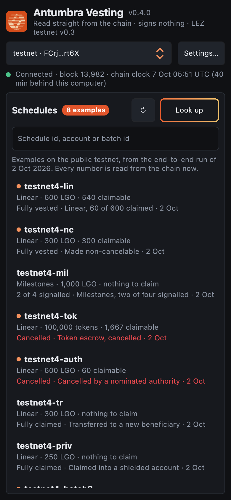
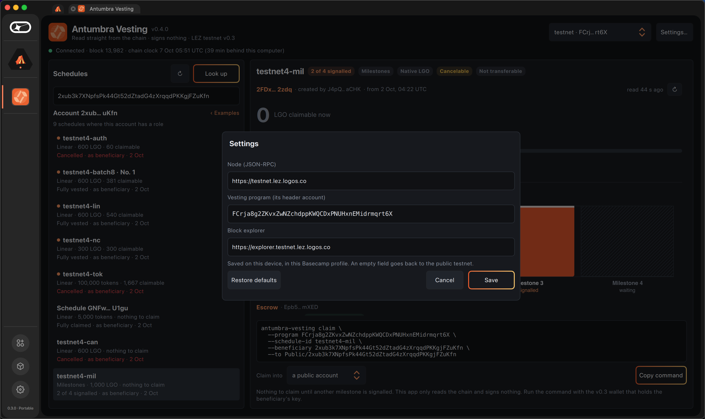

# Antumbra Vesting for Basecamp

A Basecamp app that looks up vesting schedules of the `antumbra_vesting`
program on the LEZ testnet v0.3 and shows what the chain holds: what has
vested, what is claimable now against the chain's own clock, what the escrow
actually holds, who can move it, and every transaction on the schedule with
the program's verdict. It holds no keys and signs nothing: to claim, it
confirms what the claim will do (the amount, the fee, and on the private path
what becomes public) and then gives the exact `antumbra-vesting` command for
the beneficiary's wallet.


## What it does

- **One field** takes a schedule id (text of at most 32 bytes, or 64 hex
  digits, as the CLI reads `--schedule-id`), a batch id (every schedule of the
  batch, numbered from 0), or a base58 account: the schedule's own account, or
  an account whose schedules are wanted. Typing works: this is a `ui_qml`
  module, not the legacy widget the v0.2 panel was.
- **Examples** are the schedules the end-to-end run of 2 Oct 2026 created on
  the public testnet ([`evidence/v03/testnet.tsv`](../evidence/v03/testnet.tsv)),
  read live: linear, milestones, a token escrow, cancelled, transferred,
  non-cancelable, claimed privately, and a batch of eight.
- **A schedule** shows the claimable amount, status chips, a claimed /
  claimable / locked bar, the vesting curve (or one bar per milestone) with
  the start, the cliff, the end, each claim, a cancellation and a marker for
  now from the chain's clock account, the escrow's native or token balance
  against what it still owes, the accounts with Copy and Explorer buttons, the
  claim command with Copy, and the activity list.
- **Activity** comes from the block explorer's index of the schedule's
  account. The index does not mark refused transactions, so each one is
  replayed against the schedule's rules (signer, amount against what had
  vested, the cancel refund, the milestone bit, last_seen for a claim at a time
  the chain had not reached) and the replay is checked against what the chain
  holds; when they disagree the view says so. A private claim shows its amount
  from the effect it recorded on the schedule; its destination stays shielded.
- **What comes next**, under the claimable amount: the accrual rate and when
  the schedule is fully vested, the amount the cliff releases and when, or
  which milestone authority has to signal what.
- **Prepare claim** sits where Logos Forum's reply box is, with the choice
  between a public destination and a shielded one. It opens the confirmation
  below; the command is only shown there.
- **The chain's clock** is its last block's time. The status line says when it
  trails the computer's clock by more than five minutes, which a quiet testnet
  does; every amount follows the chain's clock, not the computer's. An open
  schedule says when it was read, is read again every minute, and has a ↻.
- **The empty screen** offers example ids to try, one click each.
- **Settings** (node, program, explorer) are saved under the Basecamp user
  directory, `$LOGOS_USER_DIR/module_data/antumbra_lez/settings.json`, so a
  throwaway `--user-dir` never touches another instance's.
  `ANTUMBRA_RPC`, `ANTUMBRA_PROGRAM` and `ANTUMBRA_EXPLORER` win over them and
  the dialog says when they do. The defaults are `https://testnet.lez.logos.co`,
  the deployed header `FCrja8g2ZKvxZwNZchdppKWQCDxPNUHxnEMidrmqrt6X` and
  `https://explorer.testnet.lez.logos.co`.

## The confirmation before a claim (RFP-017 U4, U5, Privacy 2)

"Prepare claim" opens a sheet that says what the claim will do before it shows
the command:

- **The claimable amount** at the chain's clock, and **the amount to claim**,
  editable and checked: more than 0 and at most what is claimable, with a
  named error otherwise (the program would refuse either with E7003, and a
  refused public claim is still charged). The command's `--amount` follows it.
- **The destination**: a public account (the beneficiary's own by default) or
  a shielded account of the beneficiary's wallet.
- **On the public path, the fee.** LEZ v0.3 reserves `gas_limit × base_fee_exec
  + data_bytes × base_fee_stor` from the payer when it takes a public
  transaction and charges what the transaction used
  (`lez/programs/fee/core/src/assess.rs`, lines 75 and 90, at `db66590a`). The
  sheet reads both base fees from the node's `getFeeState`, prices the reserve
  at the 300,000 gas limit the CLI is run with and about 700 bytes (public
  claims on the testnet are 653 and 685 bytes), and the expected charge at
  the claim's measured gas ([`executor-tests/CYCLES.md`](../executor-tests/CYCLES.md)).
  If the node does not quote its fee market, it prices at the protocol's
  minimum base fee of 8 (`lez/programs/fee/core/src/market.rs`, lines 17 and
  29) and says the real fee can only be higher. It then reads the
  beneficiary's balance, since the beneficiary signs and pays unless `--payer`
  names another account, and says whether it covers the reserve; if not, it
  shows "Insufficient balance for the fee" with how much is missing.
- **On the private path, no fee**: a privacy-preserving transaction is exempt
  on v0.3 (`lez/chain_state/src/classify.rs`, line 53). The beneficiary still
  signs it, so the sheet checks on chain that its account is initialised (a
  nonce or a balance) and shows "Signing account not initialised" if not.
- **On the private path, the privacy disclosure**, in the RFP's terms: visible
  on chain to anyone are the claim amount (the schedule's claimed total and
  its escrow's balance change by it), the beneficiary address (it signs), the
  vesting schedule address and its escrow's, and the time the claim names;
  not traceable are the destination private account and subsequent movements
  of the claimed tokens. The command appears only once the box under it is
  ticked, and the box is cleared every time the sheet opens or the path
  changes.

The app still signs nothing: the sheet ends with the command and a Copy
button, for the v0.3 wallet that holds the beneficiary's key. These renders
are `app/tests/qml_host.cpp` against the public testnet, not Basecamp:




The Basecamp screenshots on this page were taken with 0.4.0, whose reply box
showed the command directly; 0.4.1 has the "Prepare claim" button there
instead ([the schedule as 0.4.1 renders it](../docs/screens/view-schedule.png)).

**What a search by account cannot find.** The sequencer has no way to list the
schedules of a beneficiary, and creating a schedule is not recorded under the
beneficiary's account (only under the schedule, its escrow and the creator).
A search by account therefore finds the schedules that account has signed for
(claims, transfers, creations) plus the examples, and the result says so. A
schedule its beneficiary has never touched is found by its id.



Below 720 px the two panes become one, with a way back, as in Logos Forum;
Basecamp's window does not go below 800 px, which is that layout:


At phone width (rendered outside Basecamp by `app/tests/qml_host.cpp`, the same
`Main.qml` against the same reader):






## Design

The look and the layout are Logos Forum's (LP-0026), control for control: its
palette and orange accent, the system font Basecamp uses, its sizes, radii,
the outlined main button, the "1 new" badge shape for status chips, the
status line with its dot, the account picker's shape for the network, two
panes becoming one. The schedules list is laid out as the Forum's Topics, a
schedule as its thread (each section with an author line: an accent label and
a muted meta), and the claim command as its reply box. The only drawing the
Forum has no equivalent for is the vesting curve, in the Forum's colours.

The icon is the author's logo redrawn as vector paths on the Forum's tile,
cream on orange, the mark filling 80% of it: [`app/design/`](design/) holds
the geometry (`gen.py`, fitted to the original bitmap with an overlap of
0.978), the icon and marks (`make.py`) and the variants that were considered
(`variants.py`). See [D-35](../docs/DECISIONS.md) for the choices.

## How it is built

A `ui_qml` module built with `mkLogosQmlModule` (logos-module-builder 0.3.1, as
Logos Forum is): [`app/src/qml/Main.qml`](src/qml/Main.qml) is the view, which
Basecamp runs; the backend runs in its own process and talks to the view over
Qt Remote Objects through [`app/src/antumbra_lez.rep`](src/antumbra_lez.rep). The
backend ([`app/src/antumbra_lez_backend.cpp`](src/antumbra_lez_backend.cpp)) only
holds the settings, opens https links on a click (Basecamp's QML sandbox
refuses `Qt.openUrlExternally` for remote URLs, so the view hands the URL over
and the backend checks it again) and hands JSON to the view. The reading and
decoding is [`app/src/vesting_chain.cpp`](src/vesting_chain.cpp), QtCore and
QtNetwork only: shards of v0.3 accounts, the 312-byte `VestingSchedule`, PDAs
of the header, the program's accrual rule, and the replay.

Two things carried over from the v0.2 panel because they still bite:

- Qt's macOS system-proxy lookup JIT-compiles a regular expression, and PCRE2's
  JIT traps under a hardened runtime without `allow-jit`, taking the process
  down on the first request. The reader declines the lookup (`NoProxy`), and
  the backend uses no `QRegularExpression` at all.
- `metadata.json` is read by CMake's `string(JSON)`, which splits on
  semicolons: a `;` in the description breaks the configure step.

```bash
nix build ./app#lgx-portable --accept-flake-config -o result     # from the repo root; or cd app first
scripts/install-local.sh /tmp/bc-antumbra app/result/*.lgx
~/Applications/LogosBasecamp-0.3.0.app/Contents/MacOS/LogosBasecamp --user-dir /tmp/bc-antumbra
```

Always a throwaway `--user-dir`, never your own Basecamp profile.
[`app/antumbra-lez.lgx`](antumbra-lez.lgx) is the darwin-arm64 package of this
version; CI builds linux-amd64, darwin-arm64 and windows-x86_64 and merges
them into one.

## Tests

```bash
cmake -S app/tests -B app/build-tests -DCMAKE_PREFIX_PATH=<Qt 6.9>
cmake --build app/build-tests
app/build-tests/chain_test app/tests/fixtures          # offline: 89 checks
app/build-tests/chain_test app/tests/fixtures --live   # also asks the public testnet
export QT_QPA_PLATFORM=offscreen QT_QUICK_CONTROLS_STYLE=Basic
app/build-tests/qml_host app/src/qml/Main.qml 1500 950 shot.png --offline              # view + sheet, 22 checks
app/build-tests/qml_host app/src/qml/Main.qml 1500 950 shot.png testnet4-lin --sheet   # the same on the testnet
app/build-tests/qml_host app/src/qml/Main.qml 1500 950 - testnet4-lin --walkthrough /tmp/frames
```

[`app/tests/chain_test.cpp`](tests/chain_test.cpp) checks the addresses against the
ones `antumbra-vesting ids` prints, decodes nine testnet schedules saved in
[`app/tests/fixtures/`](tests/fixtures/) (vested, claimed, claimable and status at
a fixed chain time), and replays the explorer's transactions for each: the
verdicts must be the ones the run's manifest recorded, step for step, and the
replay must end where the chain is. [`app/tests/qml_host.cpp`](tests/qml_host.cpp)
runs the real `Main.qml` against the real reader with a stand-in for what
Basecamp gives a view; CI loads it at three widths with the node unreachable
and fails on any QML warning. At each width it then opens the confirmation on
testnet4-lin as saved in the fixtures and checks it: the public path shows the
command for the claimable amount and no disclosure; an amount of 0, one over
the claimable amount and one that is not a number each show a named error and
hide the command; the private path shows the disclosure and hides the command
until it is acknowledged, then shows it below the disclosure, with a
`Private/` destination. With the node unreachable it also shows the fee
priced at the minimum base fee and the beneficiary as not read. It saves
`<out>-sheet-public.png` and `<out>-sheet-private.png`. `--sheet` runs the same
checks on the schedule a query opened, against the live node.
`--walkthrough DIR` saves numbered frames (15 per second of film) of a tour
of a schedule and of both paths of the sheet, for the demo film:
`ffmpeg -framerate 15 -i DIR/f%05d.png -pix_fmt yuv420p tour.mp4`.

Verified in Basecamp 0.3.0 on macOS with a throwaway user directory, against
the public testnet: the examples load, typing an id and pressing Return opens
it (testnet4-lin, testnet4-mil), a batch id lists its eight schedules, a
beneficiary's account lists the schedules it has a role in, Settings opens,
refuses a bad URL and saves a good one to the profile's `module_data`, and
Basecamp's narrowest window gives one pane. Copy (the view's clipboard) and
Explorer (the backend's https-only opener) were exercised in Basecamp while
the view was built; the final run leaves the clipboard and the browser alone.
That Basecamp run was 0.4.0; the confirmation sheet of 0.4.1 has been checked
in the Qt host above, at three widths, offline and against the testnet.
